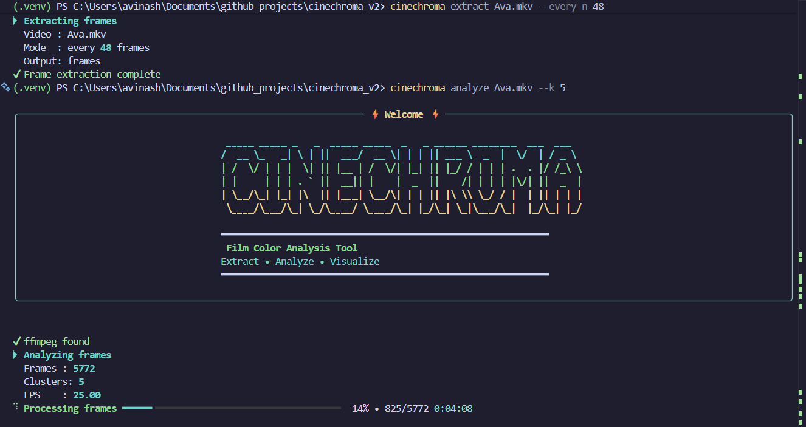

# 🎬 CINECHROMA

[](https://www.python.org/downloads/)
[](LICENSE)

**Professional film color analysis from the command line** — Extract, analyze, and visualize the color palette of any video with cinematic precision.



---

## ✨ Features

- 🎨 **Color Strip Generation** — Create horizontal color timelines showing dominant colors frame-by-frame
- 🎭 **Movie-Level Palettes** — Extract palettes by luminance bands (Light, Medium, Dark, Overall)
- 🔍 **Smart Analysis** — Automatic letterbox detection and intelligent black/white filtering
- 📊 **Video Information** — Extract detailed metadata using ffprobe (FPS, resolution, codec, etc.)
- 🎯 **Frame Extraction** — Extract every Nth frame or keyframes only
- ⚡ **Fast & Efficient** — Optimized with KMeans clustering and Lab color space
- 🌈 **Beautiful CLI** — Rich terminal UI with progress bars and neon aesthetics

---

## 🚀 Installation

### Prerequisites

- Python 3.8 or higher
- FFmpeg and FFprobe installed and available in PATH

### Install from source

```bash
git clone https://github.com/yourusername/cinechroma_v2.git
cd cinechroma_v2
pip install -e .
```

### Verify installation

```bash
cinechroma --version
```

---

## 📖 Usage

### Quick Start

```bash
# Extract frames from a video
cinechroma extract movie.mp4

# Analyze color palette
cinechroma analyze movie.mp4

# Render color strip visualization
cinechroma render strip output/analysis.json

# Render movie palette bars
cinechroma render palette output/analysis.json
```

### Complete Workflow

```bash
# 1. Get video information
cinechroma info movie.mp4

# 2. Extract every 24th frame
cinechroma extract movie.mp4 --every-n 24 --frames-dir my_frames/

# 3. Analyze with 6 color clusters
cinechroma analyze movie.mp4 --k 6 --frames-dir my_frames/ --out results/analysis.json

# 4. Generate visualizations
cinechroma render strip results/analysis.json --height 600 --out results/strip.png
cinechroma render palette results/analysis.json --out results/palette.png

# 5. Clean up when done
cinechroma clean
```

---

## 🎯 Commands

### `info` — Video Metadata

Extract detailed video information using ffprobe.

```bash
cinechroma info movie.mp4
```

**Output:**
- Resolution (width × height)
- Duration (seconds)
- FPS (frames per second)
- Codec name
- Pixel format
- Color primaries/transfer

---

### `extract` — Frame Extraction

Extract frames from video files.

```bash
# Extract every 24th frame
cinechroma extract movie.mp4 --every-n 24

# Extract keyframes only
cinechroma extract movie.mp4 --keyframes

# Custom output directory
cinechroma extract movie.mp4 --frames-dir my_frames/
```

**Options:**
- `--every-n N` — Extract every Nth frame (default: 24)
- `--keyframes` — Extract keyframes (I-frames) only
- `--frames-dir PATH` — Output directory for frames (default: `frames/`)

---

### `analyze` — Color Analysis

Analyze frames and generate color data.

```bash
cinechroma analyze movie.mp4 --k 5
```

**Options:**
- `--k N` — Number of color clusters per frame (default: 5)
- `--frames-dir PATH` — Directory containing extracted frames (default: `frames/`)
- `--out PATH` — Output JSON file path (default: `output/analysis.json`)
- `--every-n N` — Extract frames during analysis
- `--keyframes` — Extract keyframes during analysis

**Features:**
- Accurate timestamps based on video FPS
- Automatic letterbox detection and removal
- Filters extreme blacks (L < 5) and whites (L > 95)
- Generates movie-level palettes (Light/Medium/Dark/Overall)

---

### `render` — Visualization

Generate visual outputs from analysis data.

#### Color Strip

Horizontal timeline showing dominant color per frame.

```bash
cinechroma render strip output/analysis.json --height 600
```

**Options:**
- `--height N` — Strip height in pixels (default: 400)
- `--out PATH` — Output file path (default: `output/strip.png`)

#### Palette Bars

Stacked bars showing movie-level palettes by luminance.

```bash
cinechroma render palette output/analysis.json
```

**Options:**
- `--out PATH` — Output file path (default: `output/palette.png`)

**Palette Categories:**
- **Light** — Colors with L > 70
- **Medium** — Colors with 30 < L ≤ 70
- **Dark** — Colors with L ≤ 30
- **Overall** — All colors combined

---

### `clean` — Cleanup

Remove generated files and directories.

```bash
# Remove default directories (frames/ and output/)
cinechroma clean

# Remove everything explicitly
cinechroma clean --all

# Remove custom directories
cinechroma clean --frames-dir my_frames/ --out-dir results/
```

---

## 🎨 Output Examples

*Examples below are from Avatar: The Way of Water (2022)*

### Color Strip

A horizontal timeline where each vertical line represents the dominant color of a frame.


Perfect for seeing color shifts throughout a film.

### Palette Bars

Four horizontal bars showing dominant colors for different luminance ranges:


**Palette Categories:**
- **Light** — Colors with L > 70
- **Medium** — Colors with 30 < L ≤ 70
- **Dark** — Colors with L ≤ 30
- **Overall** — All colors combined

Mimics professional film color analysis references.

---

## 🔧 Technical Details

### Color Space
- Analysis performed in **CIE Lab color space** for perceptual uniformity
- RGB ↔ Lab conversion using scikit-image
- KMeans clustering for dominant color extraction

### Processing Pipeline
1. **Frame Loading** — Load and resize to 64×64 for efficiency
2. **Letterbox Detection** — Remove black bars (top/bottom 10% regions)
3. **Color Conversion** — RGB → Lab color space
4. **Luminance Filtering** — Remove L < 5 and L > 95
5. **Clustering** — KMeans in Lab space
6. **Palette Generation** — Split by luminance bands and cluster

### Performance
- Subsampling for movie palettes (max 100k pixels)
- Adaptive cluster count (never exceeds available samples)
- Efficient numpy operations throughout

---

## 📁 Project Structure

```
cinechroma_v2/
├── cinechroma/
│   ├── __init__.py
│   ├── cli.py          # Command-line interface
│   ├── extract.py      # Frame extraction (ffmpeg)
│   ├── analyze.py      # Color analysis (KMeans, Lab)
│   ├── render.py       # Visualization generation
│   ├── ui.py           # Rich terminal UI components
│   └── utils.py        # Utility functions
├── frames/             # Extracted frames (gitignored)
├── output/             # Analysis results (gitignored)
├── pyproject.toml      # Package configuration
└── README.md
```

---

## 🛠️ Dependencies

- **opencv-python** — Image loading and processing
- **scikit-learn** — KMeans clustering
- **scikit-image** — Lab color space conversion
- **Pillow** — Image saving
- **numpy** — Numerical operations
- **rich** — Beautiful terminal UI
- **pyfiglet** — ASCII art banners

---

## 🤝 Contributing

Contributions are welcome! Feel free to:

- 🐛 Report bugs
- 💡 Suggest new features
- 🔧 Submit pull requests

---

## 📄 License

This project is licensed under the MIT License.

---

## 🙏 Acknowledgments

Inspired by professional film color analysis tools and the movie barcode concept.

---

## 📧 Contact

For questions or feedback, please open an issue on GitHub.

---

**Made with ❤️ for film enthusiasts and color nerds**